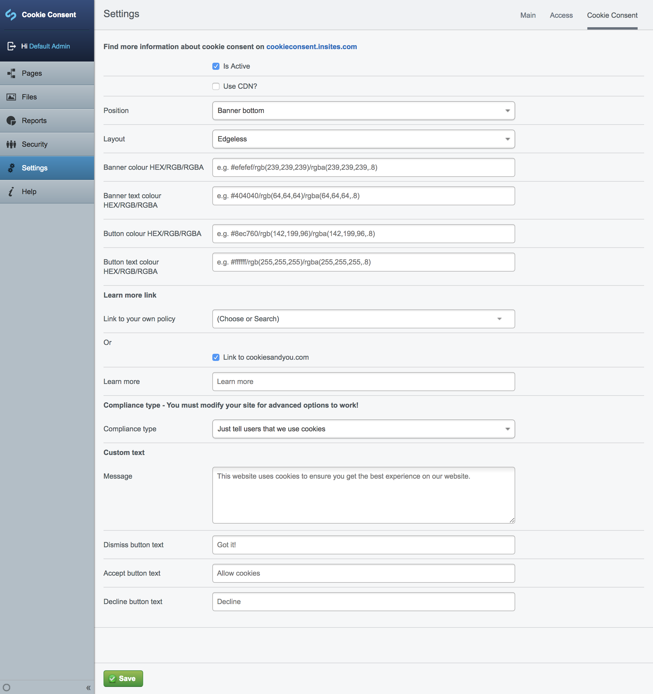

# silverstripe-cookie-consent

Silverstripe Cookie Consent is a module which enables to configure
the [cookie consent JavaScript plugin](https://cookieconsent.insites.com/) from [Insites](https://insites.com/)
simply via the Administrator Backend.



## Requirements

- Silverstripe CMS ~3.2

## Installation


```sh
composer require nomidi/silverstripe-cookie-consent
```
Alternatively simply download the zip file from github.
After installation run a run `dev/build?flush=1` on your project.

## Configuration

The Configuration is done via the `Settings` and the `Cookie Consent` tab.
Please keep in mind that if you are using the advanced options you will have to ensure that the Cookies and there functionality
act accordingly. With this module you are just setting the configuration for CookieConsent but it will not change the cookie behaviour.


## Todo

- If CookieConsent runs locally, add the js internally - leads right now to issues with e.replace
- Testing
